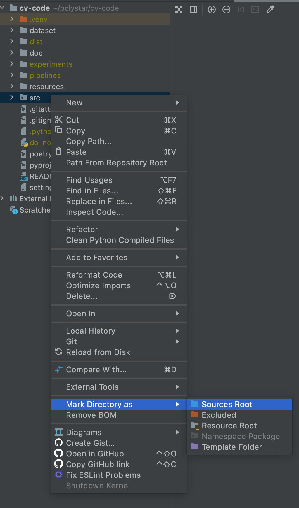
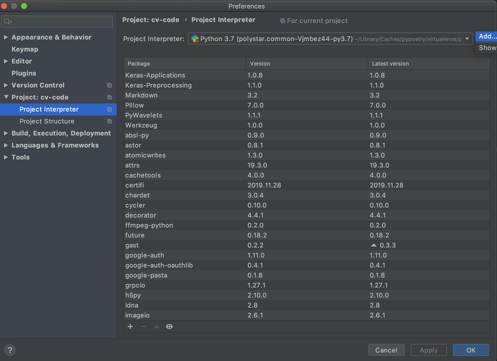
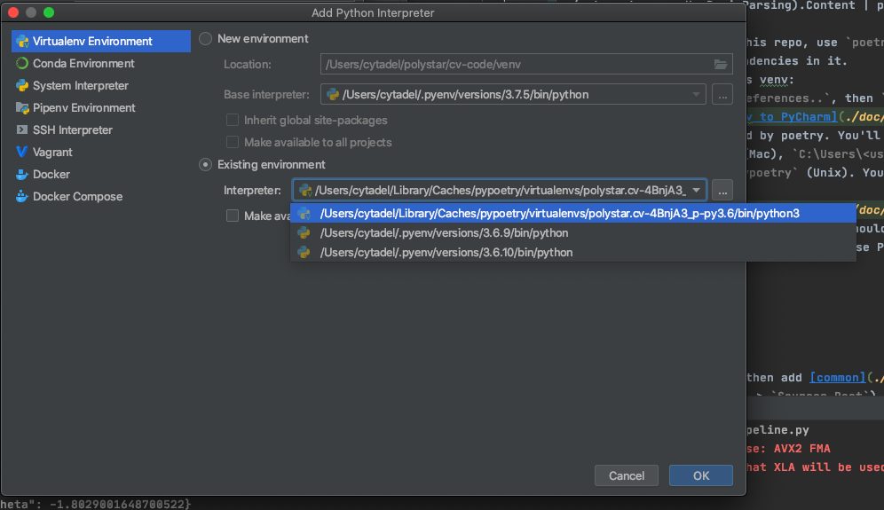
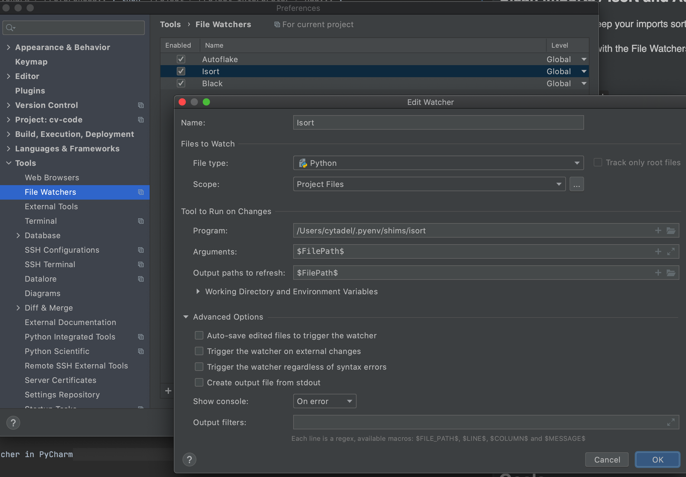
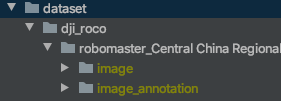
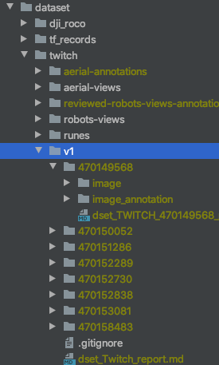

# Computer Vision system

## Setup


### Gitlab / SSH keys

Once you have access to [our gitlab](https://git.step.polymtl.ca/polystar/robomaster/computer-vision), you should setup your ssh key, so you don't have to enter your credentials at every git operation. [The tutorials on gitlab (Settings > SSH keys)](https://git.step.polymtl.ca/profile/keys) should get you set upped on this.


### IDE / PyCharm

Our IDE is [PyCharm](https://www.jetbrains.com/fr-fr/pycharm/). As students, we have access to a free full version [https://www.jetbrains.com/fr-fr/community/education/#students]().

You can use another IDE, but you need to find how to configure the following tools on your own.


### Relative imports / PyCharm

If you are using pycharm, then add [src](./src) as `Sources Root` (right click on common, then `Mark Directory As` > `Sources Root`).



It will enable the relative imports (eg. `from polystar.utils.str_utils import snake2camel` will be understood by Pycharm).


### Dependency management / Poetry

We use [poetry](https://python-poetry.org/) to manage our dependencies.

1. Install poetry
    ```bash
    # LINUX / OSX
    curl -sSL https://raw.githubusercontent.com/python-poetry/poetry/master/get-poetry.py | python

    # Windows (you need to type this from PowerShell, *not* the regular terminal)
    (Invoke-WebRequest -Uri https://raw.githubusercontent.com/python-poetry/poetry/master/get-poetry.py -UseBasicParsing).Content | python
    ```
2. In the root folder of this repo, use `poetry install`. It will create a virtualenv, and install all the dependencies in it.
3. Tell Pycharm to use this venv:
    a. Go to `Pycharm > Preferences..`, then `Project > Project Interpreter > Add...`:
        
    b. Add the venv created by poetry. You'll find it somewhere in `~/Library/Caches/pypoetry/virtualenvs/` (Mac), `C:\Users\<username>\AppData\Local\pypoetry\Cache` (Windows) or `~/.cache/pypoetry` (Unix). You need to link the python3 executable in `bin`:
        
     c. Hit `Ok`, then `Apply`. PyCharm should update its indexes. **Restart the terminal for the changes to apply in it if you use PyCharm's terminal**


### Code formatter / Black (optional but recommended)

To format your code in the same way as everybody else, we use [Black](https://pypi.org/project/black/). They have a [nice install section](https://black.readthedocs.io/en/stable/editor_integration.html#pycharm-intellij-idea). I strongly recommend doing their 3rd step, using the File Watchers plugin to run Black on every file save. This way, your files will be nicely formatted every time you save them.

For reference, the config used is in [./pyproject.toml](pyproject.toml).


### Clean imports / Isort and AutoFlake (optional but recommended)

#### Isort

[Isort](https://pypi.org/project/isort/) is a tool that will keep your imports sorted nicely, so you dont have to worry about that part.

We install it and use it with the File Watchers plugin, as done for Black:

1. Install isort

    `pip install isort`
    
2. Locate it

    (MacOS / Linux) `which isort`
    
    (Windows) `where isort`
    
3. Create a watcher in PyCharm.

    Refer to the parameters used for black. It should look like:
    
    

    
#### AutoFlake    

[AutoFlake](https://pypi.org/project/autoflake/) will remove the unused imports for you. Reproduce the steps you used to set up isort, and use the following for the `Arguments` field on FileWatcher: `--in-place --remove-all-unused-imports $FilePath$`.
    
    
### Dataset

#### ROCO

Download the directory [PolySTAR/RoboMaster/Équipe-Computer vision/DJI ROCO](https://drive.google.com/drive/folders/1AM3PqwwHzlK3tAS-1R5Qk3edPv0T4NzB) in Drive, with the 4 datasets given by DJI, and unzip in folder [dataset/dji_roco](./dataset/dji_roco).

The dji_roco directory should look like:



#### TWITCH

Download the directory [PolySTAR/RoboMaster/Équipe-Computer vision/datasets/twitch/v1](https://drive.google.com/drive/folders/1TaxdzB57U9wII9K2VDOEP8vUMm94_cR7) in Drive, with the 8 labelized videos from twitch, and unzip in folder [dataset/twitch/v1](dataset/twitch/v1).

The twitch/v1 directory should look like:




#### Check

To verify that the datasets are correctly set upped, you can run the tests in [./common/tests/common/integration_tests/datasets](./src/tests/common/integration_tests/datasets).


## Quick overview on organisation

### Repo Organisation

 - [src](src) You'll find all the code there
 - [dataset](dataset) In this directory, we add the images that are part of our datasets
 - [experiments](experiments) (not versioned) All reports for experiments will go there
 - [pipelines](pipelines) (not versioned) Saved pipelines and models go there
 - [resources](resources) Some files that have nowhere else to go (as external libs used on the nano)  
 - [doc](doc) stores the images used for this readme


## Goals

For each project, we defined a few steps toward the automatisation

0. No automatisation, the pilot does everything
1. The pilot chooses a target, then select a "follow" mode. The CV helps maintaining the shooter facing toward the target. The pilot controls when to shoot.
2. The pilot chooses a target, then select a "shoot" mode. The CV maintain the shooter facing toward the target, and make the shooting decision.
3. The pilot let the CV system to decide when to shoot, and which robot to shoot, depending on the distance to the targets, the probability to hit, and the type of robots.

The main goal is not to reach step 3 for every project: reaching step 1 would already help a lot the pilots !


## Control Team

[This google doc](https://docs.google.com/document/d/1_WRp8hKwjJ7E_uIMwRmgCmimuRtpEut-U4GsiJyBkTw) serves as a CdC for the link with the Control Team.