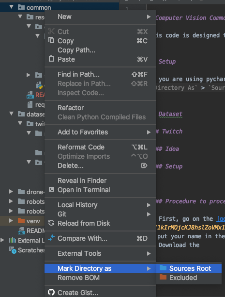

# Computer Vision system

## Setup


### Requirements

We use [poetry](https://python-poetry.org/) to manage our dependencies.

1. Install poetry
    ```bash
    # LINUX / OSX
    curl -sSL https://raw.githubusercontent.com/python-poetry/poetry/master/get-poetry.py | python

    # Windows
    (Invoke-WebRequest -Uri https://raw.githubusercontent.com/python-poetry/poetry/master/get-poetry.py -UseBasicParsing).Content | python
    ```
2. In the root folder of this repo, use `poetry install`. It will create a virtualenv, and install all the dependencies in it.
3. Tell Pycharm to use this venv:
    a. Go to `Pycharm > Preferences..`, then `Project > Project Interpreter > Add...`:
        
    b. Add the venv created by poetry. You'll find it somewhere in `~/Library/Caches/pypoetry/virtualenvs/` (Mac), `C:\Users\<username>\AppData\Local\pypoetry\Cache` (Windows) or `~/.cache/pypoetry` (Unix). You need to link the python3 executable in `bin`:
        
     c. Hit `Ok`, then `Apply`. PyCharm should update its indexes. **Restart the terminal for the changes to apply in it if you use PyCharm's terminal**


### Relative imports

If you are using pycharm, then add [common](./) as `Sources Root` (right click on common, then `Mark Directory As` > `Sources Root`). The project you are woking on should be added the same way.



It will enable the relative imports.


## Repo Organisation

 - [./common] In this directory, we write common code that can be used by every sub-project
 - [./dataset] In this directory, we add the images that are part of our dataset
 - Sub projects
    - [./drone-at-base]: The goal is to detect the base from the drone
    - [./robots-at-robots]: The goal is to identify and track the robots 
    - [./robots-at-runes]: The goal is to infer the runes rotation angle and speed
    
    
## Sub-project organisation

The organisation for ech sub-project should follow the structure:

 - a `research` directory, where all the tests / model training, and code that shouldn't be ran by the robots would go
 - a `polystar/{sub_project_name}` directory, where the code that should be ran by the robots should go 


## Goals

For each project, we defined a few steps toward the automatisation

0. No automatisation, the pilot does everything
1. The pilot chooses a target, then select a "follow" mode. The CV helps maintaining the shooter facing toward the target. The pilot controls when to shoot.
2. The pilot chooses a target, then select a "shoot" mode. The CV maintain the shooter facing toward the target, and make the shooting decision.
3. The pilot let the CV system to decide when to shoot, and which robot to shoot, depending on the distance to the targets, the probability to hit, and the type of robots.

The main goal is not to reach step 3 for every project: reaching step 1 would already help a lot the pilots ! 
