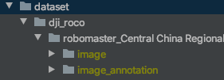
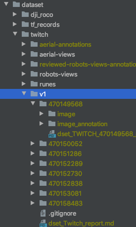

# Computer Vision Common code

This code is designed to be shared across projects


### Dataset

#### ROCO

Download the directory [PolySTAR/RoboMaster/Équipe-Computer vision/DJI ROCO](https://drive.google.com/drive/folders/1AM3PqwwHzlK3tAS-1R5Qk3edPv0T4NzB) in Drive, with the 4 datasets given by DJI, and unzip in folder [dataset/dji_roco](../dataset/dji_roco).

The dji_roco directory should look like:



#### TWITCH

Download the directory [PolySTAR/RoboMaster/Équipe-Computer vision/datasets/twitch/v1](https://drive.google.com/drive/folders/1TaxdzB57U9wII9K2VDOEP8vUMm94_cR7) in Drive, with the 8 labelized videos from twitch, and unzip in folder [dataset/twitch/v1](../dataset/twitch/v1).

The twitch/v1 directory should look like:




## Dataset creation

### Twitch

#### Idea

There are a lot of video posted by RoboMaster on their [twitch channel](https://www.twitch.tv/robomaster).

**But**, there are 2 issues to convert it to an exploitable dataset:
 - Videos are very long (a dozen of hours per video)
 - Only short sequences (per chunks of ~5s) are from robot views
 
We found that it was possible to detect the HUD on the videos, to check if the image is a robot view or not. 

#### Setup

##### ffmpeg

To split the video into frames, we use ffmpeg.

**Note:** If you get an error using ffmpeg, be sure that you installed the right python package (it should be `ffmpeg-python`, not `ffmpeg` or `python-ffmpeg`) 

###### MAC

```bash
brew install ffmpeg
```

###### Windows

You should follow [this tutorial](https://video.stackexchange.com/questions/20495/how-do-i-set-up-and-use-ffmpeg-in-windows).


##### Twitch Video Downloader

You have 2 options to download the videos:

 - [TwitchLeecher](https://github.com/Franiac/TwitchLeecher/releases). Unfortunately, it is only available on Windows.
 - [4k Video Downloader](https://www.4kdownload.com/products/product-videodownloader). It works on windows, Mac and Linux.

#### Procedure to process a video

1. First, go on the [google sheet](https://docs.google.com/spreadsheets/d/1kIrMOjcKJ8hslZoVMx1D0H7QYj9nQLFvzUAQ1U4Le-I/edit#gid=0), and choose a video that nobody already did, and put your name in the 2nd column
2. Download the video, in **720p**
3. Rename it using the video id on twitch, and place it in [../dataset/twitch/videos](../dataset/twitch/videos)
5. Launch the python script [./research/common/scripts/extract_robots_views_from_video.py](research/common/scripts/extract_robots_views_from_video.py), with the video id as parameter (In Pycharm, `Run` > `Edit Configurations...`, then in parameters enter the id). You can put multiple video ids by separating them with spaces.

The frames will appear in the [../dataset/twitch/robots-views](../dataset/twitch/robots-views) folder.

#### Aerial dataset

Once you have the robots views in the [../dataset/twitch/robots-views](../dataset/twitch/robots-views) folder, run the python script [./research/common/scripts/move_aerial_views.py](research/common/scripts/move_aerial_views.py). It will put the aerial views in the [../dataset/twitch/aerial-views](../dataset/twitch/aerial-views) directory.


