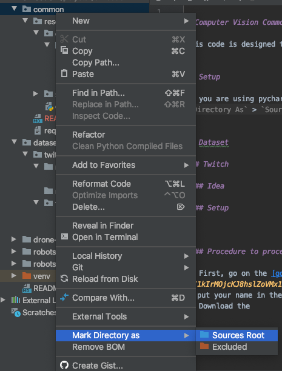

# Computer Vision Common code

This code is designed to be shared across projects


## Setup

### Relative imports

If you are using pycharm, then add [common](./) as `Sources Root` (right click on common, then `Mark Directory As` > `Sources Root`).



It will enable the relative imports.


### Requirements

Install the required python modules
```bash
python -m pip install -r requirements.txt
```

## Dataset

### Twitch

#### Idea

There are a lot of video posted by RoboMaster on their [twitch channel](https://www.twitch.tv/robomaster).

**But**, there are 2 issues to convert it to an exploitable dataset:
 - Videos are very long (a dozen of hours per video)
 - Only short sequences (per chunks of ~5s) are from robot views
 
We found that it was possible to detect the HUD on the videos, to check if the image is a robot view or not. 

#### Setup

##### ffmpeg

To split the video into frames, we use ffmpeg.

**Note:** If you get an error using ffmpeg, be sure that you installed the right python package (it should be `ffmpeg-python`, not `ffmpeg` or `python-ffmpeg`) 

###### MAC

```bash
brew install ffmpeg
```

###### Windows

You should follow [this tutorial](https://video.stackexchange.com/questions/20495/how-do-i-set-up-and-use-ffmpeg-in-windows).


##### TwitchLeecher

We use [TwitchLeecher](https://github.com/Franiac/TwitchLeecher/releases) to download the videos. Unfortunately, it is only available on Windows. If you find a way to download entire videos on Mac, please update this README.

#### Procedure to process a video

1. First, go on the [google sheet](https://docs.google.com/spreadsheets/d/1kIrMOjcKJ8hslZoVMx1D0H7QYj9nQLFvzUAQ1U4Le-I/edit#gid=0), and choose a video that nobody already did, and put your name in the 2nd column
2. Download the video with TwitchLeecher, in **720p**
3. Rename it using the video id on twitch, and place it in [../dataset/twitch/videos](../dataset/twitch/videos)
4. Launch the python script [./research/scripts/monitor_new_twitch_frames.py](./research/scripts/monitor_new_twitch_frames.py) through PyCharm. It will check for new frames in the [raw-frames directory](../dataset/twitch/raw-frames), and move those that are a robot view.
5. Launch the second python script [./research/scripts/split_video.py](./research/scripts/split_video.py), with the video id as parameter (In Pycharm, `Run` > `Edit Configurations...`, then in parameters enter the id).

The frames will appear in the [../dataset/twitch/robots-views](../dataset/twitch/robots-views) folder.
